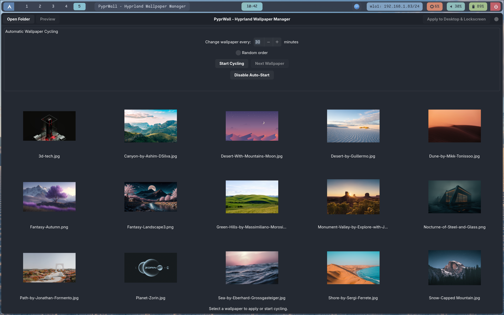

# PyprWall - Hyprland Wallpaper Manager

## Overview

PyprWall is a GTK4-based wallpaper manager specifically designed for Hyprland compositor users. It provides a simple graphical interface to manage and apply wallpapers for both your desktop (hyprpaper) and lockscreen (hyprlock).

## Features

- Browse and select wallpaper folders
- Thumbnail preview of all wallpapers in a directory
- Preview selected wallpapers in full size
- One-click application to both desktop and lockscreen
- Persistent memory of last used folder
- Clean, modern GTK4 interface

## Screenshot

Below is a screenshot of PyprWall in action:



## Dependencies

PyprWall requires the following dependencies:

### Core Dependencies
- Python 3.7+
- PyGObject (GTK4 bindings)
- hyprpaper (for desktop wallpapers)
- hyprlock (for lockscreen wallpapers)

### Python Packages
- PyGObject (with Gtk, Adw, and Gdk support)
- Required GObject Introspection libraries:
  - Gtk 4.0
  - Adw 1
  - Gdk 4.0

## Installation

### From the AUR (Arch Linux)

PyprWall is available in the AUR. You can install it using your favorite AUR helper:

**With yay:**
```bash
yay -S pyprwall
```

**With paru:**
```bash
paru -S pyprwall
```

### From Source

1. Clone or download the PyprWall repository
2. Install required dependencies:

**On Arch Linux:**
```bash
sudo pacman -S python-gobject hyprpaper hyprlock
```

**On Ubuntu/Debian:**
```bash
sudo apt install python3-gi python3-gi-cairo gir1.2-gtk-4.0 gir1.2-adw-1
# Install hyprpaper and hyprlock from source or appropriate repositories
```

3. Make the script executable:
```bash
chmod +x pyprwall.py
```

4. Run the application:
```bash
./pyprwall.py
```

### Creating a Desktop File

To create a desktop entry for PyprWall:

1. Create a file called `pyprwall.desktop` in `~/.local/share/applications/`:

```ini
[Desktop Entry]
Version=1.0
Type=Application
Name=PyprWall
Comment=Hyprland Wallpaper Manager
Exec=/path/to/pyprwall.py
Icon=preferences-desktop-wallpaper
Categories=Utility;GTK;
Keywords=wallpaper;hyprland;hyprpaper;hyprlock;
StartupNotify=true
Terminal=false
```

2. Replace `/path/to/pyprwall.py` with the actual path to your PyprWall script.

3. Make sure the desktop file is executable:
```bash
chmod +x ~/.local/share/applications/pyprwall.desktop
```

## Usage

1. Launch PyprWall from your application menu or terminal
2. Click "Open Folder" to select a directory containing wallpapers
3. Select a wallpaper from the thumbnail grid
4. Use "Preview" to see a larger version of the selected wallpaper
5. Click "Apply to Desktop & Lockscreen" to set the wallpaper

## Backend Support

**Note:** PyprWall is specifically designed for and only supports:
- hyprpaper for desktop wallpapers
- hyprlock for lockscreen wallpapers

There are no plans to add support for other wallpaper backends or lock screen managers. This application is specifically tailored for the Hyprland ecosystem.

## Configuration

PyprWall automatically creates and manages:
- `~/.config/hypr/hyprpaper.conf` - for desktop wallpaper configuration
- `~/.config/hypr/hyprlock.conf` - for lockscreen configuration
- `.pyprwall_config` in the script directory - stores the last used folder path

## Troubleshooting

- Ensure hyprpaper and hyprlock are properly installed and configured
- Make sure the selected wallpaper folder contains image files in supported formats (PNG, JPG, JPEG, JXL, WEBP)
- If wallpapers don't apply, check that Hyprland is running with the proper IPC permissions

## License

This project is provided as-is without any specific license. Feel free to use and modify for personal use.

## Contributing

As this is a specialized tool for Hyprland users, contributions are welcome but should maintain the focus on hyprpaper and hyprlock support exclusively.